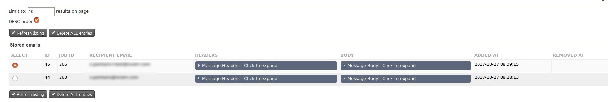

# Project moved to https://lab.civicrm.org/extensions/mailreader

# com.ixiam.modules.mailreader

## What this extension does?

Normally, when we are working on a test/development site, we don't want to have the mail option activated, so that we can avoid potential faulty email sending and/or spamming. For such cases, we usually disable the email sending functionality, by navigating to:
**Administer CiviCRM -> System Settings -> Outbound Email (SMTP/Sendmail)** and switch to '**Disabled Outbound Email**'.

However, there are some pitfalls by doing that:
If we have a function that tries to send an email, regardless of the settings we've provided, that function will crash (WSOD). A less catastrophic alternative is that we simply want to see how the emails will look like without actually sending them.

That's where this extension kicks in: By setting the email sending option to '**Redirect to Database**' and by using this extension, we can now see how the emails look like, without muting the functionality of CiviCRM.

## Where do I find the Email viewer ?

After installing this extension (and assuming that you did select the 'Redirect to Database' option), you should see an entry labeled 'Stored Mail reader' under the Menu entry 'Support'.

Please note: This form requires '**Administer CiviCRM**' priviledges to display.

## Please explain the options

* **Limit to**: How many entries would you like to appear on the page? Default is **10**.
* **DESC order**: The sort order that will be used to display the entries. Default is "**DESC**".
* Button: **Refresh listing**: After changing some/any of the options above, you need to click the button so that the actual refresh happens
* Button: **Delete ALL entries**: Self explanatory: Will delete **ALL** database rows from the table 'civicrm_mailing_spool'. Please be careful as **there is no undo** function!
